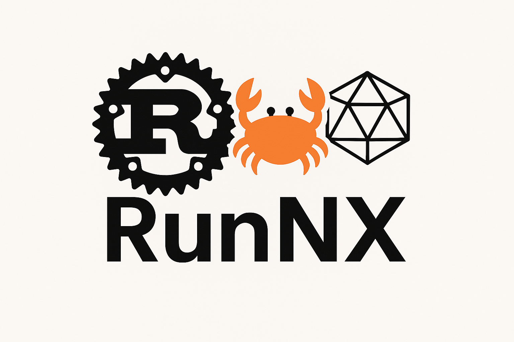

# RunNX

A minimal, verifiable ONNX runtime implementation in Rust.

[](https://crates.io/crates/runnx)
[](https://docs.rs/runnx)
[](LICENSE)
[](https://codecov.io/gh/jgalego/runnx)



## Overview

> Fast, fearless, and fully verifiable ONNX in Rust.

This project provides a minimal, educational ONNX runtime implementation focused on:
- **Simplicity**: Easy to understand and modify
- **Verifiability**: Clear, testable code with comprehensive documentation
- **Performance**: Efficient operations using ndarray
- **Safety**: Memory-safe Rust implementation

## Features

- ✅ Basic tensor operations (`Add`, `Mul`, `MatMul`, `Conv`, &c.)
- ✅ Model loading and validation
- ✅ Inference execution
- ✅ Error handling and logging
- ✅ Benchmarking support
- ✅ Async support (optional)
- ✅ Command-line runner
- ✅ Comprehensive examples

## Quick Start

### Installation

Add this to your `Cargo.toml`:

```toml
[dependencies]
runnx = "0.1.0"
```

### Basic Usage

```rust
use runnx::{Model, Tensor};

// Load a model
let model = Model::from_file("model.onnx")?;

// Create input tensor
let input = Tensor::from_array(ndarray::array![[1.0, 2.0, 3.0]]);

// Run inference
let outputs = model.run(&[("input", input)])?;

// Get results
let result = outputs.get("output").unwrap();
println!("Result: {:?}", result.data());
```

### Command Line Usage

```bash
# Run inference on a model
cargo run --bin runnx-runner -- --model model.onnx --input input.json

# Run with async support
cargo run --features async --bin runnx-runner -- --model model.onnx --input input.json
```

## Architecture

The runtime is organized into several key components:

### Core Components

- **Model**: ONNX model representation and loading
- **Graph**: Computational graph with nodes and edges
- **Tensor**: N-dimensional array wrapper with type safety
- **Operators**: Implementation of ONNX operations
- **Runtime**: Execution engine with optimizations

### Supported Operators

| Operator      | Status   | Notes                       |
| ------------- | -------- | --------------------------- |
| `Add`         | ✅      | Element-wise addition        |
| `Mul`         | ✅      | Element-wise multiplication  |
| `MatMul`      | ✅      | Matrix multiplication        |
| `Conv`        | ✅      | 2D Convolution               |
| `Relu`        | ✅      | Rectified Linear Unit        |
| `Sigmoid`     | ✅      | Sigmoid activation           |
| `Reshape`     | ✅      | Tensor reshaping             |
| `Transpose`   | ✅      | Tensor transposition         |

## Examples

### Simple Linear Model

```rust
use runnx::{Model, Tensor};
use ndarray::Array2;

fn main() -> Result<(), Box<dyn std::error::Error>> {
    // Initialize logging
    env_logger::init();

    // Create a simple linear transformation: y = x * w + b
    let weights = Array2::from_shape_vec((3, 2), vec![0.5, 0.3, 0.2, 0.4, 0.1, 0.6])?;
    let bias = Array2::from_shape_vec((1, 2), vec![0.1, 0.2])?;
    
    let input = Tensor::from_array(Array2::from_shape_vec((1, 3), vec![1.0, 2.0, 3.0])?);
    let w_tensor = Tensor::from_array(weights);
    let b_tensor = Tensor::from_array(bias);
    
    // Manual computation for verification
    let result1 = input.matmul(&w_tensor)?;
    let result2 = result1.add(&b_tensor)?;
    
    println!("Linear transformation result: {:?}", result2.data());
    Ok(())
}
```

### Model Loading and Inference

```rust
use runnx::{Model, Tensor};
use std::collections::HashMap;

fn main() -> Result<(), Box<dyn std::error::Error>> {
    // Load model from file
    let model = Model::from_file("path/to/model.onnx")?;
    
    // Print model information
    println!("Model: {}", model.name());
    println!("Inputs: {:?}", model.input_names());
    println!("Outputs: {:?}", model.output_names());
    
    // Prepare inputs
    let mut inputs = HashMap::new();
    inputs.insert("input", Tensor::zeros(&[1, 3, 224, 224]));
    
    // Run inference
    let outputs = model.run(&inputs)?;
    
    // Process outputs
    for (name, tensor) in outputs {
        println!("Output '{}': shape {:?}", name, tensor.shape());
    }
    
    Ok(())
}
```

## Performance

The runtime includes benchmarking capabilities:

```bash
# Run benchmarks
cargo bench

# Generate HTML reports
cargo bench -- --output-format html
```

Example benchmark results:
- Basic operations: ~10-50 µs
- Small model inference: ~100-500 µs
- Medium model inference: ~1-10 ms

## Development

### Running Tests

```bash
# Run all tests
cargo test

# Run tests with logging
RUST_LOG=debug cargo test

# Run specific test
cargo test test_tensor_operations
```

### Building Documentation

```bash
# Build and open documentation
cargo doc --open

# Build with private items
cargo doc --document-private-items
```

### Contributing

1. Fork the repository
2. Create a feature branch
3. Make your changes
4. Add tests and documentation
5. Run `cargo test` and `cargo bench`
6. Submit a pull request

## License

This project is licensed under

* Apache License, Version 2.0, ([LICENSE-APACHE](LICENSE-APACHE) or http://www.apache.org/licenses/LICENSE-2.0)
* MIT license ([LICENSE-MIT](LICENSE-MIT) or http://opensource.org/licenses/MIT)


## Acknowledgments

- [ONNX](https://onnx.ai/) - Open Neural Network Exchange format
- [ndarray](https://github.com/rust-ndarray/ndarray) - Rust's `ndarray` library
- [Candle](https://github.com/huggingface/candle) - Inspiration for some design patterns

## Roadmap

- [ ] Add more operators (Softmax, BatchNorm, etc.)
- [ ] GPU acceleration support
- [ ] Quantization support
- [ ] Model optimization passes
- [ ] WASM compilation target
- [ ] Python bindings
