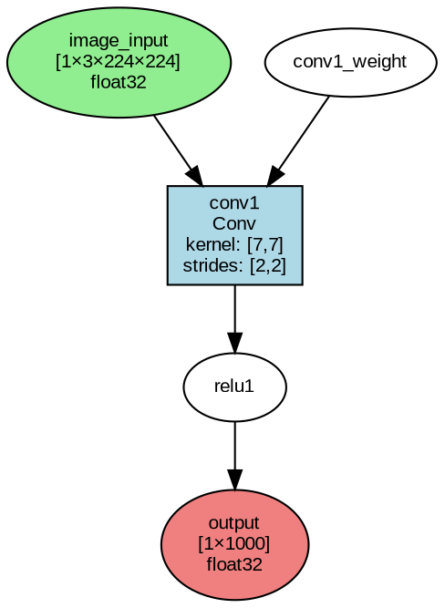
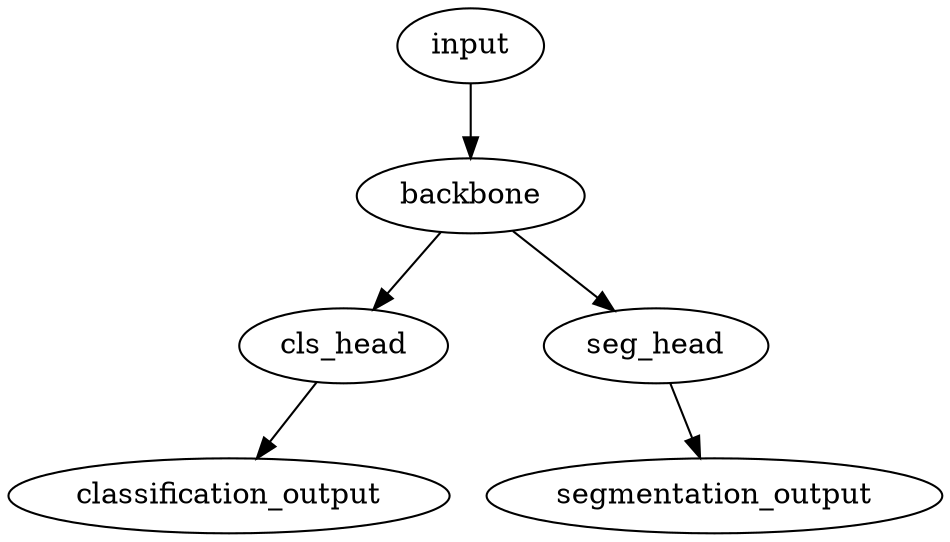

# Graph Visualization Guide

RunNX provides comprehensive graph visualization capabilities to help you understand and debug ONNX model structures. This guide covers both terminal visualization and professional diagram generation.

## Overview

RunNX offers two main visualization approaches:

1. **Terminal Visualization**: Beautiful ASCII art representations for quick model inspection
2. **Graphviz Export**: Professional-quality diagrams for documentation and presentations

## Terminal Visualization

### Basic Usage

Display your model's graph structure directly in the terminal:

```rust
use runnx::Model;

let model = Model::from_file("model.onnx")?;
model.print_graph();
```

Or using the CLI:

```bash
./target/release/runnx-runner --model model.onnx --graph
```

### Example Output

Here's what the terminal visualization looks like for a neural network:

```
┌────────────────────────────────────────┐
│       GRAPH: neural_network_demo       │
└────────────────────────────────────────┘

📥 INPUTS:
   ┌─ image_input [1 × 3 × 224 × 224] (float32)
   ┌─ mask_input [1 × 1 × 224 × 224] (float32)

⚙️  INITIALIZERS:
   ┌─ conv1_weight [64 × 3 × 7 × 7]
   ┌─ conv1_bias [64]
   ┌─ fc_weight [1000 × 512]
   ┌─ fc_bias [1000]

🔄 COMPUTATION FLOW:
   │
   ├─ Step 1: conv1
   │  ┌─ Operation: Conv
   │  ├─ Inputs:
   │  │  └─ image_input
   │  │  └─ conv1_weight
   │  │  └─ conv1_bias
   │  ├─ Outputs:
   │  │  └─ conv1_output
   │  └─ Attributes:
   │     └─ kernel_shape: [7, 7]
   │     └─ strides: [2, 2]
   │     └─ pads: [3, 3, 3, 3]
   │
   ├─ Step 2: relu1
   │  ┌─ Operation: Relu
   │  ├─ Inputs:
   │  │  └─ conv1_output
   │  ├─ Outputs:
   │  │  └─ relu1_output
   │  └─ (no attributes)

📤 OUTPUTS:
   └─ classification [1 × 1000] (float32)
   └─ segmentation [1 × 21 × 224 × 224] (float32)

📊 STATISTICS:
   ├─ Total nodes: 10
   ├─ Input tensors: 2
   ├─ Output tensors: 2
   └─ Initializers: 4

🎯 OPERATION SUMMARY:
   ├─ Conv: 3 operations
   ├─ Relu: 3 operations
   ├─ MaxPool: 1 operation
   ├─ Add: 2 operations
   └─ MatMul: 1 operation
```

### Features

- **Dynamic Layout**: Title box automatically adjusts to graph name length
- **Unicode Symbols**: Rich visual elements using Unicode box-drawing characters
- **Detailed Information**: Shows shapes, data types, and operator attributes
- **Topological Ordering**: Displays operations in execution order
- **Statistics**: Comprehensive summary of model structure

## Graphviz Export

### Basic DOT Export

Generate professional Graphviz DOT format:

```rust
let dot_content = model.to_dot()?;
std::fs::write("model.dot", dot_content)?;
```

Or using the CLI:

```bash
./target/release/runnx-runner --model model.onnx --dot model.dot
```

### DOT Format Structure

The generated DOT file uses a clean, structured format:



### Generating Images

Convert DOT files to various image formats:

```bash
# PNG format (good for web/documentation)
dot -Tpng model.dot -o model.png

# SVG format (scalable vector graphics)
dot -Tsvg model.dot -o model.svg

# PDF format (publication quality)
dot -Tpdf model.dot -o model.pdf

# High-resolution PNG
dot -Tpng -Gdpi=300 model.dot -o model_hires.png
```

### Advanced Layouts

Graphviz supports different layout algorithms:

```bash
# Top-to-bottom (default)
dot -Tpng model.dot -o model_tb.png

# Left-to-right
dot -Grankdir=LR -Tpng model.dot -o model_lr.png

# Circular layout
circo -Tpng model.dot -o model_circular.png

# Force-directed layout
neato -Tpng model.dot -o model_neato.png
```

## Color Coding

RunNX uses a consistent color scheme for different node types:

- **🟢 Green Ellipses**: Input tensors
- **🔵 Blue Diamonds**: Initializers (weights, biases)
- **⬜ Blue Rectangles**: Operations/Operators
- **🔴 Red Ellipses**: Output tensors

This color coding makes it easy to understand data flow at a glance.

## Complex Model Examples

### YOLO Object Detection

For a YOLO model, the visualization shows the complete detection pipeline:

```
🔄 COMPUTATION FLOW:
   │
   ├─ Step 1: backbone_conv1
   │  ┌─ Operation: Conv
   │  └─ Feature extraction: 640×640×3 → 320×320×64
   │
   ├─ Step 15: neck_concat1
   │  ┌─ Operation: Concat
   │  └─ Feature fusion: Multiple scales → Combined features
   │
   ├─ Step 23: head_detection
   │  ┌─ Operation: Conv
   │  └─ Detection head: Features → Raw predictions
   │
   └─ Step 24: nms
      ┌─ Operation: NonMaxSuppression
      └─ Post-processing: Raw predictions → Final detections
```

### Multi-Branch Networks

For models with multiple outputs (e.g., classification + segmentation):



## Interactive Exploration

### Model Summary with Graph

Combine model summary with graph visualization:

```bash
./target/release/runnx-runner --model model.onnx --summary --graph
```

This shows:
1. Model metadata and version information
2. Input/output specifications
3. Complete graph visualization
4. Operation statistics

### Debugging Workflows

Use visualization for debugging:

```bash
# 1. Check model structure
./target/release/runnx-runner --model suspicious_model.onnx --graph

# 2. Export for detailed analysis
./target/release/runnx-runner --model suspicious_model.onnx --dot debug.dot

# 3. Generate high-res image for inspection
dot -Tpng -Gdpi=300 debug.dot -o debug_detailed.png
```

## Customization

### Custom Node Labels

The visualization automatically includes relevant information:

- **Tensor shapes**: `[1×3×224×224]`
- **Data types**: `float32`, `int64`
- **Operator attributes**: `kernel_shape: [3,3]`, `strides: [1,1]`

### Layout Optimization

For large models, use these techniques:

```bash
# Reduce node size for large graphs
dot -Nfontsize=8 -Nwidth=0.5 -Nheight=0.3 -Tpng model.dot -o compact.png

# Focus on specific subgraphs
# (Extract relevant sections from DOT file manually)

# Use hierarchical layout for very large models
dot -Granksep=2 -Tpng model.dot -o spaced.png
```

## Integration with Documentation

### Embedding in Markdown

```markdown
# Model Architecture

Our YOLO model uses the following architecture:


The model consists of:
- Backbone: Feature extraction
- Neck: Feature fusion  
- Head: Detection output
```

### Programmatic Generation

```rust
fn generate_model_docs(model_path: &str, output_dir: &str) -> Result<(), Box<dyn std::error::Error>> {
    let model = Model::from_file(model_path)?;
    
    // Generate DOT file
    let dot_content = model.to_dot()?;
    let dot_path = format!("{}/model.dot", output_dir);
    std::fs::write(&dot_path, dot_content)?;
    
    // Generate PNG
    std::process::Command::new("dot")
        .args(&["-Tpng", &dot_path, "-o", &format!("{}/model.png", output_dir)])
        .output()?;
    
    // Generate documentation
    let docs = format!(
        "# Model: {}\n\n\n\n{}",
        model.name().unwrap_or("Unnamed"),
        model.summary()
    );
    std::fs::write(format!("{}/README.md", output_dir), docs)?;
    
    Ok(())
}
```

## Performance Considerations

### Large Models

For very large models (1000+ operations):

1. **Use compact layouts**: Reduce font sizes and node spacing
2. **Generate SVG**: Vector format scales better than PNG
3. **Split into subgraphs**: Focus on specific model sections
4. **Use terminal visualization**: Faster for quick inspection

### Memory Usage

Graph generation memory usage:
- **Terminal visualization**: Minimal overhead
- **DOT generation**: ~1MB per 100 operations
- **Image rendering**: Depends on Graphviz and output resolution

## Best Practices

### Documentation Workflow

1. **Quick inspection**: Use terminal visualization during development
2. **Detailed analysis**: Generate DOT files for complex debugging
3. **Documentation**: Create PNG/SVG images for reports and papers
4. **Version control**: Include DOT files in repositories for reproducibility

### Automation

```bash
#!/bin/bash
# Automated model documentation script

MODEL_PATH=$1
OUTPUT_DIR=$2

# Create output directory
mkdir -p "$OUTPUT_DIR"

# Generate all visualization formats
./target/release/runnx-runner --model "$MODEL_PATH" --dot "$OUTPUT_DIR/model.dot"
dot -Tpng "$OUTPUT_DIR/model.dot" -o "$OUTPUT_DIR/model.png"
dot -Tsvg "$OUTPUT_DIR/model.dot" -o "$OUTPUT_DIR/model.svg"
dot -Tpdf "$OUTPUT_DIR/model.dot" -o "$OUTPUT_DIR/model.pdf"

echo "Model documentation generated in $OUTPUT_DIR"
```

## Troubleshooting

### Common Issues

**DOT generation fails**:
- Check model file is valid
- Ensure sufficient memory for large models

**Image generation fails**:
- Install Graphviz: `sudo apt-get install graphviz`
- Check DOT file syntax: `dot -Tplain model.dot`

**Large graphs are unreadable**:
- Use compact layout options
- Generate SVG for better scaling
- Split into logical subgraphs

### Performance Tips

- Use terminal visualization for rapid iteration
- Generate images only when needed for documentation
- Cache generated visualizations for large models

## Next Steps

- **[Usage Examples](examples.md)** - More visualization examples
- **[API Reference](../api/model.md)** - Complete API documentation
- **[CLI Reference](cli.md)** - Command-line options
- **[Assets Guide](../../assets/README.md)** - Using visualization assets
